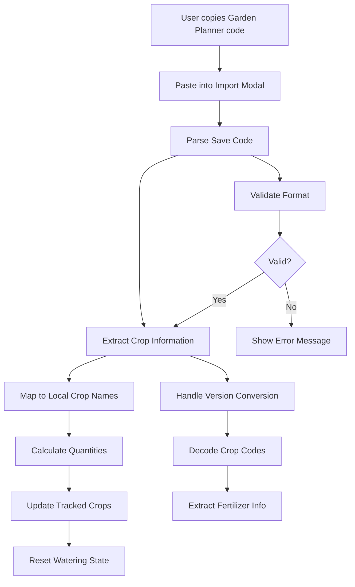

# Palia Watering Tracker: CRA to Next.js Migration Plan

## Overview

This document outlines the comprehensive migration plan to move the Palia Watering Tracker from Create React App (CRA) to Next.js with shadcn/ui components. The migration will be a complete replacement, preserving all existing functionality while modernizing the architecture.

## Current Project Analysis

### Existing CRA Structure

```
palia-watering-tracker/
├── src/
│   ├── components/           # 12 React components
│   ├── hooks/               # 2 custom hooks (useGardenStore.ts, useUnifiedGardenStore.ts)
│   ├── services/            # 4 service modules
│   ├── types/               # 3 type definition files
│   ├── App.tsx              # Main app with React Router
│   ├── index.tsx            # CRA entry point
│   └── index.css            # Global styles
├── public/                  # Static assets (crop images, crops.json)
├── docs/                    # Comprehensive documentation
└── package.json             # CRA dependencies
```

### Key Components Identified

1. **Core Components**: `MainTracker`, `CropWateringItem`, `ImportModal`
2. **Grid System**: `GridPreview`, `TileComponent`
3. **State Management**: `useUnifiedGardenStore` (Zustand store) - **PRESERVE**
4. **Services**: `plannerService`, `layoutService`, `migrationService`

### Target Next.js Structure

```
/ (Next.js root)
├── app/                     # Next.js App Router
├── components/              # Migrated + shadcn components
├── hooks/                   # Custom hooks
├── lib/                     # Utilities + services
├── types/                   # Type definitions
└── public/                  # Static assets
```

## Migration Strategy

### Phase 1: Foundation Setup ✅

**Status**: Already completed - Next.js + shadcn structure exists

### Phase 2: Core Migration (Week 1-2)

#### 2.1 Dependencies Migration

**Add Missing Dependencies:**

```json
{
  "zustand": "^5.0.5",
  "uuid": "^11.1.0",
  "@types/uuid": "^10.0.0"
}
```

**Remove After Migration:**

```json
{
  "react-router-dom": "^7.6.2", // Replace with Next.js routing
  "react-scripts": "5.0.1", // CRA specific
  "web-vitals": "^2.1.4" // CRA specific
}
```

#### 2.2 Type System Migration

**Target Structure:**

```
types/
├── index.ts              # Basic Plant interface
├── unified.ts            # Zustand store types (PRESERVE)
├── layout.ts             # Grid and layout types
└── garden.ts             # Garden planner integration types
```

**Migration Actions:**

- ✅ Keep `unified.ts` as-is (comprehensive type system)
- ✅ Migrate `layout.ts`
- ✅ Preserve `index.ts` structure

#### 2.3 Services Migration

**Target Structure:**

```
lib/
├── services/
│   ├── plannerService.ts     # Garden planner integration
│   ├── layoutService.ts      # Layout management
│   ├── migrationService.ts   # Legacy data migration
│   └── index.ts              # Service exports
├── utils.ts                  # Existing shadcn utils
└── constants.ts              # App constants
```

### Phase 3: State Management Migration (Week 2)

#### 3.1 Zustand Store Migration

**Priority**: HIGH - Core functionality depends on this

**Migration Plan:**

1. ✅ **PRESERVE** `useUnifiedGardenStore.ts` - This is the main store
2. ❌ **REMOVE** `useGardenStore.ts` - Legacy store to be removed
3. **MIGRATE** to `hooks/useUnifiedGardenStore.ts`

**Key Features to Preserve:**

- ✅ Crop tracking with manual/import sources
- ✅ Daily watering state management
- ✅ Garden planner integration (`saveAndLoadLayout`, `loadLayoutById`)
- ✅ Legacy data migration support
- ✅ localStorage persistence

### Phase 4: Component Migration (Week 2-3)

#### 4.1 Routing Migration

**From React Router to Next.js App Router:**

| CRA Route  | Next.js Route | Component         |
| ---------- | ------------- | ----------------- |
| `/`        | `/`           | `MainTracker`     |
| `/preview` | `/preview`    | `GridPreviewPage` |
| `/import`  | `/import`     | `ImportPage`      |
| `/test`    | `/test`       | `GridPreviewTest` |

**Target Structure:**

```
app/
├── page.tsx                 # MainTracker (home)
├── preview/page.tsx         # GridPreviewPage
├── import/page.tsx          # ImportPage
├── test/page.tsx            # GridPreviewTest
├── layout.tsx               # Root layout
└── globals.css              # Global styles
```

#### 4.2 Component Migration Priority

**Tier 1 - Core Components (Week 2):**

1. `MainTracker` → `app/page.tsx`
2. `CropWateringItem` → `components/CropWateringItem.tsx`
3. `CropSummaryComponent` → `components/CropSummaryComponent.tsx`

**Tier 2 - Grid System (Week 3):** 4. `GridPreview` → `components/GridPreview.tsx` 5. `TileComponent` → `components/TileComponent.tsx` 6. `PlantComponent` → `components/PlantComponent.tsx`

**Tier 3 - Import System (Week 3):** 7. `ImportModal` → `components/ImportModal.tsx` 8. `ImportPage` → `app/import/page.tsx` 9. `GridPreviewPage` → `app/preview/page.tsx`

**Tier 4 - Utilities (Week 4):** 10. `MigrationBanner` → `components/MigrationBanner.tsx` 11. `UnifiedStoreTest` → `app/test/page.tsx` 12. `GridPreviewTest` → `components/GridPreviewTest.tsx`

#### 4.3 shadcn Integration Strategy

**Replace Custom UI with shadcn Components:**

- Buttons → `@/components/ui/button`
- Modals → `@/components/ui/dialog`
- Cards → `@/components/ui/card`
- Forms → `@/components/ui/form`
- Inputs → `@/components/ui/input`
- Selects → `@/components/ui/select`
- Tabs → `@/components/ui/tabs`
- Tooltips → `@/components/ui/tooltip`

### Phase 5: Asset Migration (Week 3)

#### 5.1 Static Assets

**Source:** `palia-watering-tracker/public/`
**Target:** `public/`

**Assets to Migrate:**

- ✅ `crops.json` - Crop data
- ✅ `images/` folder - All crop images (65px-\*.webp, Corn.png)
- ✅ `index.html` - Extract any meta tags/config

#### 5.2 Styling Migration

**Current:** Tailwind CSS (already configured)
**Target:** Maintain Tailwind + shadcn styling

**Migration Actions:**

- ✅ Keep existing Tailwind config
- ✅ Merge any custom styles from `palia-watering-tracker/src/index.css`
- ✅ Ensure responsive design patterns are preserved

### Phase 6: Garden Planner Integration (Week 4)

#### 6.1 Integration Requirements

Based on `GARDEN_PLANNER_INTEGRATION.md`:

**Key Features to Preserve:**

- ✅ Save code parsing (v0.1 → v0.4 support)
- ✅ Crop code mappings
- ✅ Import validation and error handling
- ✅ Layout visualization
- ✅ Import history management

**Services Integration:**

- ✅ `plannerService.ts` - Core parsing logic
- ✅ `layoutService.ts` - Layout management
- ✅ Integration with `useUnifiedGardenStore` methods

## File Mapping

### Complete Migration Map

```mermaid
graph TD
    subgraph "CRA Structure"
        A[palia-watering-tracker/src/]
        A1[components/]
        A2[hooks/]
        A3[services/]
        A4[types/]
        A5[App.tsx]
    end

    subgraph "Next.js Structure"
        B[/ (root)]
        B1[app/]
        B2[components/]
        B3[hooks/]
        B4[lib/services/]
        B5[types/]
    end

    A1 --> B2
    A1 --> B1
    A2 --> B3
    A3 --> B4
    A4 --> B5
    A5 --> B1
```

### Detailed File Mapping

| Source File                          | Target File                      | Migration Type  | Priority |
| ------------------------------------ | -------------------------------- | --------------- | -------- |
| `src/App.tsx`                        | `app/layout.tsx` + routing       | Transform       | High     |
| `src/components/MainTracker.tsx`     | `app/page.tsx`                   | Direct          | High     |
| `src/components/ImportPage.tsx`      | `app/import/page.tsx`            | Direct          | High     |
| `src/components/GridPreviewPage.tsx` | `app/preview/page.tsx`           | Direct          | High     |
| `src/components/GridPreviewTest.tsx` | `app/test/page.tsx`              | Direct          | Medium   |
| `src/hooks/useUnifiedGardenStore.ts` | `hooks/useUnifiedGardenStore.ts` | **PRESERVE**    | Critical |
| `src/hooks/useGardenStore.ts`        | ❌ **REMOVE**                    | Delete          | N/A      |
| `src/services/*`                     | `lib/services/*`                 | Direct          | High     |
| `src/types/*`                        | `types/*`                        | Direct          | High     |
| `src/components/*.tsx`               | `components/*.tsx`               | Direct + shadcn | Medium   |
| `public/*`                           | `public/*`                       | Direct          | Medium   |

## Dependencies Analysis

### Dependencies to Add

```json
{
  "zustand": "^5.0.5",
  "uuid": "^11.1.0",
  "@types/uuid": "^10.0.0"
}
```

### Dependencies Already Available ✅

- React 19.0.0 (compatible)
- TypeScript 5+ (compatible)
- Tailwind CSS (configured)
- All shadcn/ui components (installed)

## Potential Challenges & Solutions

### Challenge 1: Client-Side Routing → App Router

**Issue**: React Router → Next.js App Router migration
**Solution**:

- Convert route components to page components
- Use Next.js navigation APIs
- Preserve route-based code splitting

### Challenge 2: localStorage Persistence

**Issue**: SSR compatibility with localStorage
**Solution**:

- Use `useEffect` for hydration
- Implement proper SSR/client state sync
- Consider `useUnifiedGardenStore` initialization pattern

### Challenge 3: Complex State Management

**Issue**: Zustand store with localStorage integration
**Solution**:

- ✅ **PRESERVE** existing `useUnifiedGardenStore` implementation
- Ensure proper SSR hydration
- Test migration scenarios thoroughly

### Challenge 4: Asset References

**Issue**: Public asset paths may need updates
**Solution**:

- Update image imports to use Next.js public folder
- Verify crop image loading
- Test responsive image handling

## Implementation Phases

### Week 1: Foundation & Core Migration

- [ ] Set up dependencies
- [ ] Migrate type definitions
- [ ] Migrate services to `lib/services/`
- [ ] Set up basic routing structure

### Week 2: State & Core Components

- [ ] Migrate `useUnifiedGardenStore` (PRESERVE)
- [ ] Remove legacy `useGardenStore`
- [ ] Migrate `MainTracker` to home page
- [ ] Migrate core watering components

### Week 3: Grid System & Import Features

- [ ] Migrate grid preview system
- [ ] Migrate import modal and pages
- [ ] Integrate shadcn components
- [ ] Test garden planner integration

### Week 4: Polish & Testing

- [ ] Complete component migration
- [ ] Asset migration and optimization
- [ ] Comprehensive testing
- [ ] Documentation updates
- [ ] Remove CRA folder

## Success Criteria

### Functional Requirements ✅

- [ ] All existing features work identically
- [ ] Garden planner integration preserved
- [ ] Data persistence maintained
- [ ] Responsive design preserved
- [ ] Performance maintained or improved

### Technical Requirements ✅

- [ ] Next.js App Router implementation
- [ ] shadcn/ui component integration
- [ ] TypeScript compatibility
- [ ] Proper SSR handling
- [ ] Clean code organization

### Migration Requirements ✅

- [ ] Zero data loss during migration
- [ ] Backward compatibility for existing users
- [ ] Legacy store removal completed
- [ ] CRA folder removed post-migration

## Garden Planner Integration Details

### Save Code Structure Support

The migration must preserve support for all Garden Planner save code versions:

```
Format: v{version}_{dimensionInfo}_{cropInfo}_{settingsInfo}
Example: v0.4_9x9-111111111-111111111-111111111-111111111-111111111-111111111-111111111-111111111-111111111_CR-T.S-P-R-W.S-Co-B-A-Cr-S-Cb-Bk-Pm-Bt_D7L0
```

### Crop Code Mappings (v0.4)

```typescript
const CROP_CODE_MAPPINGS = {
  N: "None",
  T: "Tomato",
  P: "Potato",
  R: "Rice",
  W: "Wheat",
  C: "Carrot",
  O: "Onion",
  Co: "Cotton",
  B: "Blueberry",
  A: "Apple",
  Cr: "Corn",
  S: "Spicy Pepper",
  Cb: "Napa Cabbage",
  Bk: "Bok Choy",
  Pm: "Rockhopper Pumpkin",
  Bt: "Batterfly Bean",
};
```

### Integration Architecture



## Next Steps

1. **Review and Approve Plan**: Stakeholder review of this migration plan
2. **Switch to Code Mode**: Begin implementation using this plan as a guide
3. **Phase 1 Execution**: Start with dependencies and core migration
4. **Iterative Development**: Follow the weekly phases outlined above
5. **Testing and Validation**: Ensure all functionality is preserved
6. **Final Cleanup**: Remove CRA folder and legacy code

This comprehensive migration plan ensures a smooth transition from Create React App to Next.js while preserving all existing functionality and improving the overall architecture with modern Next.js patterns and shadcn/ui components.
